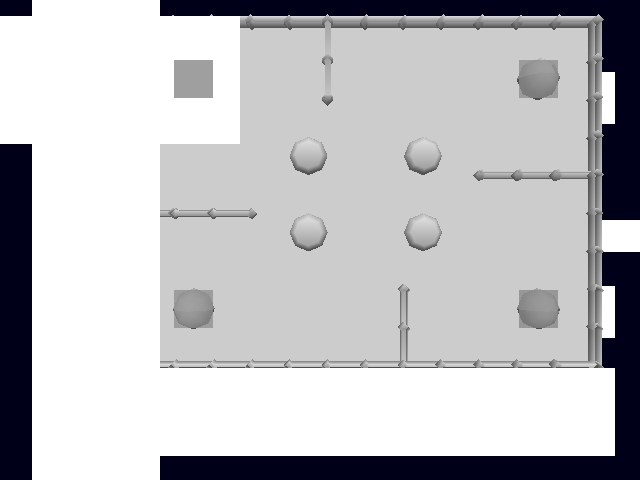

# chuchu - ChuChu Rocket!, statically recompiled

ChuChu Rocket! (Dreamcast, 1999) translated from SH-4 machine code into C and
built as a native x86-64 binary. Not an emulator: there is no interpreter and no
JIT, and nothing decodes an SH-4 instruction at runtime. The game's 21,624
functions were turned into C functions ahead of time and compiled by MSVC.



That is the game's own geometry, drawn by its own code: walls, arrow panels,
rockets, the board. It is grey because the renderer does not do textures yet -
every texture reads as flat white, which is also why the Sega logo comes up as a
white square. The shapes are the game's; the colours are missing.

Built on [dcrecomp](https://github.com/sp00nznet/dcrecomp), which does the
translating and provides the hardware layer.

## State

Working:

- boots its own bootstrap, formats and reads its flash settings partition
- initialises the GD-ROM drive, parses ISO9660, streams and decompresses its
  assets - PRS archives, PVM texture bundles, stage data
- reaches its main loop and stays there, running its scene sequence
- runs MANATEE.DRV on the AICA's ARM7 - the game's own sound driver, off the
  disc, on an interpreted ARM7DI
- programs the PowerVR2: video timing, scanout, TA lists, region and parameter
  bases, STARTRENDER every frame
- feeds the tile accelerator through the store queues and CH2-DMA, and renders
  its geometry - up to a few thousand triangles a frame, at about 28fps

Not working:

- **textures.** The renderer draws flat-shaded triangles. This is the single
  biggest gap between the screenshot above and the game.
- **sound.** The AICA's own ARM7 runs the game's real driver now, but the
  chip's 64-channel mixer is not implemented, so the driver's channel writes go
  into a register array and nothing reaches the speakers. See below.
- **input.** Maple returns a plugged-in controller with nothing pressed.
- speed. About 28fps against the hardware's 60, most of it spent in the
  interrupt path rather than in the game.

## Building

You need your own copy of the game. Nothing in this repository will produce a
playable binary on its own, and no game data is distributed here.

Put your dump in `disc/` - the cue and its track files. Both `disc/` and
`extracted/` are ignored by git.

```
# 1. Extract the filesystem.
python dcrecomp/tools/extract_gdi.py disc/chuchu.cue extracted

# 2. Translate the executable to C. Writes src/game/ and include/game/.
python dcrecomp/tools/static_recompile.py extracted/1ST_READ.BIN src/game include/game
python tools/generate_stubs.py

# 3. Build.
cmake -B build -G "Visual Studio 17 2022" -A x64 \
      -DCMAKE_TOOLCHAIN_FILE=<vcpkg>/scripts/buildsystems/vcpkg.cmake
cmake --build build --config Release --parallel 8
```

SDL2 and GLEW come from vcpkg. Without the toolchain file CMake silently
configures a headless build, so if you get no window, that is why.

The game also reads its own filesystem off the raw tracks at runtime, so
`disc/` has to keep them. `src/main.c` names them and the LBA each starts at:

```c
sh4_bios_set_gdrom_track("disc/chuchu (Track 03).bin", 45150);
sh4_bios_set_gdrom_track("disc/chuchu (Track 19).bin", 505194);
```

If your dump names or lays out its tracks differently, that is the line to
change. `extract_gdi.py` prints the layout it finds.

`src/main.c` is the bring-up file: entry point, RAM size, BIOS vectors, which
disc tracks live at which LBA, and the interrupt handler the game expects at
VBR+0x600. It is the only hand-written game-specific code here.

## The sound processor

The AICA has an ARM7 of its own and the sound driver runs on it, not on the
SH-4. dcrecomp interprets that processor, so what runs here is the real
MANATEE.DRV the game uploads off its own disc.

It works. The driver boots from its reset vector, sets up its interrupt levels,
programs Timer A, takes and acknowledges its own FIQs, and settles into its idle
loop at about the rate the hardware would - a few million instructions a second
against the real chip's 2.8MHz. Left alone it writes both handshake values the
game waits on: `'EXEC'` at sound RAM +0xF8, and the request-done flag at
+0x12400.

Two stubs used to fake exactly those two words. They are gone. One is left:

```c
sh4_stub_function(0x8C0ECF34, 0);           /* sound bank load */
```

**Nothing plays yet.** The driver runs, but the AICA's 64-channel PCM/ADPCM
mixer is not implemented - the channel registers it programs are an array that
nothing reads back. That mixer, and the driver's reply interrupt to the SH-4,
are what is left.

That reply is the interesting one. The driver signals the SH-4 by raising bit 5
of MCIPD, which arrives as SB_ISTNRM bit 15. That bit is level-triggered and
only the game's own handler clears it, so raising it today stalls the SH-4
inside its interrupt handler and the game stops drawing. `DCRECOMP_AICA_IRQ=1`
turns it on to work on.

Two things worth knowing if you go near this:

- **Timer A is interrupt bit 6**, not 5. The driver enables `SCIEB=0x48` - bit 6
  for its timer and bit 3 alongside it.
- **The FIQ handler dispatches on register 0x2D00**, the interrupt-request
  level, and that level is not stored anywhere. It is assembled bit by bit from
  the three SCILV registers, which are bit-planes: for pending interrupt N, its
  level is bit N of each of the three, low plane first. Return a constant zero
  there and the handler spins forever with nothing to dispatch on - which is
  exactly what it did here, 62,000 reads a second, until that register was
  computed properly.

## Debugging

The framework carries the tools that found everything here. All off by default:

| Variable | What it does |
| --- | --- |
| `DCRECOMP_HWREG` | first write to each hardware register |
| `DCRECOMP_STACKEVERY=N` | the call chain interrupted, every Nth interrupt |
| `DCRECOMP_WATCH=addr` | write watchpoint, with the chain that did it |
| `DCRECOMP_AICAPOLL` | sound RAM words the game is stuck reading |
| `DCRECOMP_ARM7` | sound processor PC, mode, rate, and the registers it polls |
| `DCRECOMP_AICATRACE` | AICA control-register traffic, tagged by which side wrote |
| `DCRECOMP_AICA_IRQ` | let the driver interrupt the SH-4 (stalls it today) |
| `DCRECOMP_SCREENSHOT=f.ppm` | write the frame to a PPM |
| `DCRECOMP_NO_RENDER` / `_NO_PRESENT` | bisect the two paths that draw |

A crash prints the faulting context, a backtrace walked from it, and the last
24 indirect-call targets - which is usually the only useful part, because
MSVC's tail calls flatten the native stack even when it is intact.

## What went wrong on the way here, in case it saves you a day

The game rendered nothing for a long time, and the reason was that **integer
division was never implemented**. The SH-4 has no divide instruction - a
division is `DIV0U` and thirty-two `DIV1` steps, and the compiler's `__udivsi3`
is built from exactly that. All three opcodes were missing from the emitter, so
they came out as comments and every division returned its numerator.

What that did, link by link, every one of which looked like its own bug:

- the tile grid is screen size divided by tile size, so 640x480 came out
  **640x15** instead of 20x15
- the graphics library asked for thirty-two times the display list memory a
  640x480 screen needs
- it failed its own VRAM budget check and returned early
- so the store queue destination was never set, so QACR stayed zero
- so **94% of store queue bursts went to address 0** - which is where all the
  geometry was going

The lesson: extract every unimplemented opcode from the generated source and
check them against the instruction set *first*. That sweep takes minutes. Two
FPU gaps (`FTRV`, `FLDI0`/`FLDI1`) and a fake second float bank were sitting in
the same blind spot.

## Credits and prior art

This exists because other people did the hard parts first. If you use any of
this, credit them too.

- **[KatanaRecomp](https://github.com/sonicfreak1337/KatanaRecomp)**
  (sonicfreak1337) - the other Dreamcast static recompiler, and further along.
  Worth reading before assuming anything here is novel.
- **[Flycast](https://github.com/flyinghead/flycast)** (flyinghead, GPLv2) - the
  reference for how this hardware actually behaves. No Flycast code is used
  here, but the PowerVR2, Holly and AICA register semantics were learned from
  it. The Holly interrupt bit numbering in particular.
- **[N64Recomp](https://github.com/N64Recomp/N64Recomp)** (Wiseguy) -
  established the static-recompilation-as-preservation approach this copies.
- **[tbg-decomp](https://github.com/lhsazevedo/tokyo-bus-guide-decomp)**
  (lhsazevedo) - matching decompilation of Tokyo Bus Guide, plus an SH-4 object
  simulator. The best prior art for validating SH-4 translation.
- **[KallistiOS](https://github.com/KallistiOS/KallistiOS)** and
  **[dreamcast.wiki](https://www.dreamcast.wiki/)** - hardware documentation.
- Hitachi's **SH-4 Software Manual** - the `DIV1` step and the FPU encodings
  are implemented from it directly.

ChuChu Rocket! is a Sega game. This project is not affiliated with or endorsed
by Sega, and no game code or data is distributed here.

## Licence

MIT - see [LICENSE](LICENSE).

That covers what is actually in this repository: the build files, `src/main.c`,
`tools/`, and the documentation. It grants no rights to anything produced by
running the recompiler over a commercial disc image - that output is a
translation of Sega's executable and remains Sega's. Bring your own copy and
generate it yourself.
